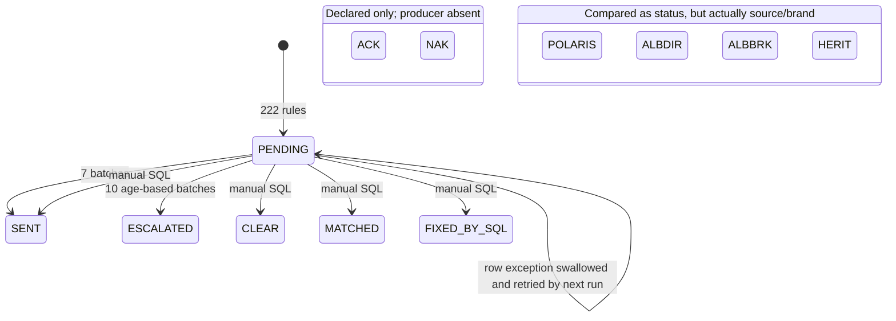

# `FeedStatus_Ext` State Machine

## Scope and evidence

`FeedStatus_Ext` is a nullable `varchar`, not a typekey and not a state-machine entity. A repository-wide scan finds 388 consumers:

| Consumer type | Count | Behaviour |
|---|---:|---|
| Gosu batch classes | 29 | All query `PENDING`; 17 write `SENT` or `ESCALATED`; 12 leave the status unchanged |
| Rules XML | 222 | Every rule assigns `PENDING`; 177 also compare the status to a brand or source literal |
| PCF files | 100 | Display or expose the string on screens, list views, detail views, and popups |
| Entity extensions | 14 | Declare the field on several entities and describe `PENDING/SENT/ACK/NAK/ESCALATED` |
| SQL data fixes | 20 | Directly write `CLEAR`, `MATCHED`, `FIXED_BY_SQL`, or `SENT` |
| Architecture/runbook Markdown | 3 before this document | Describes operational dependency and risk |

The entity descriptions say the field “drives 11 different batches.” The executable repository now has 29 batch consumers, so the comment is a historical lower bound rather than a complete inventory.

## Literal catalogue

| Literal | Classification | Observed use |
|---|---|---|
| `PENDING` | Intended workflow status | Dominant queried state. All 29 batches select it; all 222 rules assign it; 52 rules compare it. |
| `SENT` | Intended workflow status | Written by seven batches and three SQL data fixes. |
| `ACK` | Intended but undocumented workflow status | Named in all 14 entity descriptions. No Gosu, rule, or SQL transition to it exists in this repository. |
| `NAK` | Intended but undocumented workflow status | Named in all 14 entity descriptions. No Gosu, rule, or SQL transition to it exists in this repository; NAK queues are described operationally in interface specs. |
| `ESCALATED` | Intended workflow status | Written by ten age-based batches; named in entity descriptions. |
| `CLEAR` | Manual data-fix status | Written by six SQL scripts. No batch or rule consumes it. |
| `MATCHED` | Manual data-fix status | Written by five SQL scripts. No batch or rule consumes it. |
| `FIXED_BY_SQL` | Manual data-fix provenance value | Written by six SQL scripts. No batch or rule consumes it. |
| `POLARIS` | Source-system literal incorrectly/ambiguously compared as a status | Compared against `FeedStatus_Ext` in 47 rules. Entity metadata defines it as a `SourceSystem_Ext` value. |
| `ALBDIR` | Brand literal incorrectly/ambiguously compared as a status | Compared against `FeedStatus_Ext` in 45 rules. |
| `ALBBRK` | Brand literal incorrectly/ambiguously compared as a status | Compared against `FeedStatus_Ext` in 53 rules. |
| `HERIT` | Brand/source literal incorrectly/ambiguously compared as a status | Compared against `FeedStatus_Ext` in 39 rules. |

`RETPLS` is a known brand literal, but no rule in this scan directly compares `FeedStatus_Ext` with `RETPLS`.

## Consolidated observed state diagram

The diagram records possible writes, not approved business transitions. Direct SQL can overwrite a value from any prior state because the scripts do not enforce a source state.

## Batch consumers

Every row below:

- queries `ABContact#FeedStatus_Ext == "PENDING"`;
- has no date bound, with a comment warning that a bad run can re-select **1.4 million heritage rows**;
- catches `Exception`, logs it, and continues;
- includes the comment “**we have swallowed real errors for years**”;
- is declared in both the named Control-M XML and `scheduler-config.xml`; comments say Control-M is live in production and the DR choice is uncertain.

| Centre | Batch consumer | Control-M job / definition | Transition on success | Unbounded-query reference |
|---|---|---|---|---|
| BC | `AlbionCollectionsFeedBatch` | `AGIC565D` / `AGI_EOM_26.xml` | `PENDING -> PENDING`; computes IPT only when premium is non-null | REG-6157 |
| BC | `AlbionDisbursementsFeedBatch` | `AGIB305D` / `AGI_NIGHTLY_06.xml` | `PENDING -> PENDING`; computes IPT only when premium is non-null | GWCC-43602 |
| BC | `AlbionInstalmentsHousekeepingBatch` | `AGIP722D` / `AGI_EOM_20.xml` | `PENDING -> PENDING`; computes IPT only when premium is non-null | PRB-26771 |
| BC | `AlbionReconciliationEscalationBatch` | `AGIC885D` / `AGI_NIGHTLY_39.xml` | `PENDING -> SENT`; stamps `LastBatchRun_Ext` | CM-10190 |
| CC | `AlbionBodilyinjuryEscalationBatch` | `AGIB601D` / `AGI_NIGHTLY_27.xml` | `PENDING -> ESCALATED` when age is over 14 days | AGI-44944 |
| CC | `AlbionCatEscalationBatch` | `AGIP156D` / `AGI_NIGHTLY_25.xml` | `PENDING -> PENDING`; computes IPT only when premium is non-null | REG-36911 |
| CC | `AlbionComplaintsHousekeepingBatch` | `AGIC470D` / `AGI_NIGHTLY_10.xml` | `PENDING -> PENDING`; computes IPT only when premium is non-null | PRB-34221 |
| CC | `AlbionFnolEscalationBatch` | `AGIC453D` / `AGI_EOM_22.xml` | `PENDING -> ESCALATED` when age is over 5 days | GWBC-6117 |
| CC | `AlbionFraudEscalationBatch` | `AGIC955D` / `AGI_EOM_33.xml` | `PENDING -> SENT`; stamps `LastBatchRun_Ext` | REG-15385 |
| CC | `AlbionPaymentsSweepBatch` | `AGIB397D` / `AGI_WEEKLY_05.xml` | `PENDING -> ESCALATED` when age is over 5 days | AGI-17607 |
| CC | `AlbionPropertyclaimsFeedBatch` | `AGIB863D` / `AGI_WEEKLY_15.xml` | `PENDING -> SENT`; stamps `LastBatchRun_Ext` | INC-48989 |
| CC | `AlbionRecoveriesSweepBatch` | `AGIC636D` / `AGI_NIGHTLY_07.xml` | `PENDING -> SENT`; stamps `LastBatchRun_Ext` | INC-36496 |
| CC | `AlbionReservesEscalationBatch` | `AGIB901D` / `AGI_EOM_25.xml` | `PENDING -> SENT`; stamps `LastBatchRun_Ext` | CM-3650 |
| CC | `AlbionSegmentationEscalationBatch` | `AGIB759D` / `AGI_EOM_12.xml` | `PENDING -> PENDING`; computes IPT only when premium is non-null | GWCC-24425 |
| CC | `AlbionSupplychainSweepBatch` | `AGIB388D` / `AGI_WEEKLY_11.xml` | `PENDING -> SENT`; stamps `LastBatchRun_Ext` | CHG-8446 |
| CC | `AlbionTppdFeedBatch` | `AGIB413D` / `AGI_NIGHTLY_31.xml` | `PENDING -> PENDING`; computes IPT only when premium is non-null | CHG-4404 |
| CM | `AlbionGdprSweepBatch` | `AGIP417D` / `AGI_WEEKLY_39.xml` | `PENDING -> ESCALATED` when age is over 30 days | GWPC-32835 |
| CM | `AlbionPartymatchEscalationBatch` | `AGIC231D` / `AGI_EOM_25.xml` | `PENDING -> ESCALATED` when age is over 10 days | AGI-24771 |
| CM | `AlbionScreeningFeedBatch` | `AGIC336D` / `AGI_NIGHTLY_38.xml` | `PENDING -> PENDING`; computes IPT only when premium is non-null | CHG-36487 |
| CM | `AlbionVendormgmtHousekeepingBatch` | `AGIC425D` / `AGI_NIGHTLY_22.xml` | `PENDING -> ESCALATED` when age is over 5 days | HERIT-556 |
| PC | `AlbionCancellationHousekeepingBatch` | `AGIC390D` / `AGI_WEEKLY_07.xml` | `PENDING -> SENT`; stamps `LastBatchRun_Ext` | GWCC-9913 |
| PC | `AlbionComplianceEscalationBatch` | `AGIB581D` / `AGI_NIGHTLY_21.xml` | `PENDING -> PENDING`; computes IPT only when premium is non-null | GWPC-6655 |
| PC | `AlbionDocumentsHousekeepingBatch` | `AGIB402D` / `AGI_WEEKLY_21.xml` | `PENDING -> ESCALATED` when age is over 30 days | DEF-1656 |
| PC | `AlbionMtaSweepBatch` | `AGIB237D` / `AGI_WEEKLY_22.xml` | `PENDING -> PENDING`; computes IPT only when premium is non-null | GWBC-18579 |
| PC | `AlbionNewbusinessHousekeepingBatch` | `AGIP971D` / `AGI_WEEKLY_30.xml` | `PENDING -> PENDING`; computes IPT only when premium is non-null | PRB-15695 |
| PC | `AlbionRatingEscalationBatch` | `AGIP651D` / `AGI_EOM_01.xml` | `PENDING -> ESCALATED` when age is over 5 days | GWCC-45483 |
| PC | `AlbionRenewalFeedBatch` | `AGIB519D` / `AGI_WEEKLY_39.xml` | `PENDING -> ESCALATED` when age is over 14 days | GWCC-39401 |
| PC | `AlbionSchemesEscalationBatch` | `AGIP138D` / `AGI_EOM_39.xml` | `PENDING -> ESCALATED` when age is over 5 days | CM-33328 |
| PC | `AlbionUnderwritingFeedBatch` | `AGIB232D` / `AGI_WEEKLY_07.xml` | `PENDING -> PENDING`; computes IPT only when premium is non-null | DEF-15606 |

### Exception transition

The effective exception transition is `PENDING -> PENDING`: the failed row is left eligible for the next run while processing continues. There is no persisted error status, attempt count, last error, or poison-row quarantine. The batch-level soft time limit also leaves the remainder for the next run.

## Rule consumers

All 222 rule consumers execute inline Gosu that sets `FeedStatus_Ext` to `PENDING` and raises a review activity. They are grouped below by executable rule directory; the count is the complete set of rule files in that group that reference the field.

| Centre | Rule family | Consumers | Status values compared before assigning `PENDING` |
|---|---|---:|---|
| BC | `assignment` | 10 | `PENDING`, `POLARIS`, `ALBDIR`, `HERIT` |
| BC | `escalation` | 9 | `PENDING`, `POLARIS`, `ALBBRK`, `HERIT` |
| BC | `preupdate` | 11 | `PENDING`, `POLARIS`, `ALBDIR`, `ALBBRK`, `HERIT` |
| BC | `segmentation` | 9 | `PENDING`, `POLARIS`, `ALBDIR`, `ALBBRK`, `HERIT` |
| BC | `validation` | 14 | `PENDING`, `POLARIS`, `ALBDIR`, `ALBBRK`, `HERIT` |
| CC | `assignment` | 12 | `PENDING`, `POLARIS`, `ALBDIR`, `ALBBRK`, `HERIT` |
| CC | `escalation` | 11 | `PENDING`, `POLARIS`, `ALBDIR`, `ALBBRK`, `HERIT` |
| CC | `preupdate` | 8 | `PENDING`, `POLARIS`, `ALBDIR`, `ALBBRK` |
| CC | `segmentation` | 12 | `PENDING`, `POLARIS`, `ALBDIR`, `ALBBRK` |
| CC | `validation` | 13 | `PENDING`, `POLARIS`, `ALBDIR`, `ALBBRK`, `HERIT` |
| CM | `assignment` | 8 | `PENDING`, `POLARIS`, `ALBBRK`, `HERIT` |
| CM | `escalation` | 12 | `PENDING`, `POLARIS`, `ALBDIR`, `ALBBRK`, `HERIT` |
| CM | `preupdate` | 8 | `PENDING`, `POLARIS`, `ALBDIR`, `ALBBRK`, `HERIT` |
| CM | `segmentation` | 12 | `PENDING`, `POLARIS`, `ALBDIR`, `ALBBRK`, `HERIT` |
| CM | `validation` | 12 | `PENDING`, `POLARIS`, `ALBDIR`, `ALBBRK`, `HERIT` |
| PC | `assignment` | 9 | `PENDING`, `POLARIS`, `ALBDIR`, `ALBBRK` |
| PC | `escalation` | 16 | `PENDING`, `POLARIS`, `ALBDIR`, `ALBBRK`, `HERIT` |
| PC | `preupdate` | 11 | `PENDING`, `POLARIS`, `ALBDIR`, `ALBBRK`, `HERIT` |
| PC | `segmentation` | 15 | `PENDING`, `POLARIS`, `ALBDIR`, `ALBBRK`, `HERIT` |
| PC | `validation` | 10 | `PENDING`, `POLARIS`, `ALBDIR`, `ALBBRK`, `HERIT` |

The ambiguous comparisons are not harmless aliases. `POLARIS` belongs to `SourceSystem_Ext`; `ALBDIR`, `ALBBRK`, and `HERIT` are brand/source concepts. Rules that compare those values to `FeedStatus_Ext` can both miss the intended record and subsequently overwrite the field with `PENDING`.

## Other consumers

### Entity extensions

The field is declared on:

- BillingCenter: `AccountPayment`, `Charge`, `DirectBillPayment`, `Invoice`, `Producer`.
- ClaimCenter: `Activity`, `ClaimContact`, `Exposure`.
- ContactManager: `ABContact`, `Address`.
- PolicyCenter: `Account`, `Job`, `PolicyContactRole`, `Producer`.

Every declaration is nullable and uses a free-form `varchar`. The description lists the intended five-state vocabulary but provides no transition constraints.

### PCF consumers

The 100 PCF consumers expose the same free-form value across BillingCenter `Invoice`, ClaimCenter `Claim`, PolicyCenter `PolicyPeriod`, and ContactManager `ABContact` views. They span assignment, bordereaux, complaints, flood, FNOL, heritage, MID, MTA, OIC, payments, renewal, schemes, screening, segmentation, and vulnerability screens. The UI files provide visibility but no central validation or transition enforcement.

### Direct SQL consumers

| Written value | Scripts | Behavioural consequence |
|---|---:|---|
| `CLEAR` | 6 | Removes records from all `PENDING`-only batches; no code transition back is documented. |
| `MATCHED` | 5 | Removes records from all `PENDING`-only batches; no code consumer exists. |
| `FIXED_BY_SQL` | 6 | Uses the status field as data-fix provenance; no code consumer exists. |
| `SENT` | 3 | Emulates the batch completion value without necessarily stamping `LastBatchRun_Ext`. |

The scripts have names dated from 2015 through 2026. Their existence means the effective state vocabulary is larger than the entity description.

## Operational risks to preserve in the baseline

1. **Double scheduling:** every batch declares both a Control-M definition and a `scheduler-config.xml` schedule. The source comments say one is meant to be disabled per environment, production uses Control-M, and DR ownership is uncertain.
2. **Unbounded selection:** all 29 batches query all `PENDING` rows without a date bound. The source explicitly warns that a run can re-select 1.4 million heritage rows.
3. **Swallowed row failures:** all 29 catch broad `Exception`, print the error, and continue. The source says, “we have swallowed real errors for years.” The row remains `PENDING`.
4. **No retry state:** repeated selection is the retry mechanism. There is no attempt counter, next-attempt time, terminal failure, or idempotency token.
5. **Conflicting semantics:** workflow status, source system, brand, and SQL-fix provenance share one column.
6. **Missing observed transitions:** `ACK` and `NAK` are advertised but no producer is present in this repository.
7. **Inconsistent completion:** `SENT` batches also stamp `LastBatchRun_Ext`; direct SQL that writes `SENT` does not.

## Future state-machine contract

A replacement may sit behind the existing string field, but Phase 0 requires unchanged external strings. The minimum contract is:

1. Accept and emit the exact existing intended status strings: `PENDING`, `SENT`, `ACK`, `NAK`, `ESCALATED`.
2. Preserve the observed rule transition `any matching record -> PENDING`.
3. Preserve the seven observed `PENDING -> SENT` batch transitions and their `LastBatchRun_Ext` side effect.
4. Preserve each age threshold for the ten `PENDING -> ESCALATED` transitions and the existing activity creation.
5. Preserve the 12 processing paths that intentionally leave status `PENDING` until an explicitly approved replacement transition exists.
6. Treat `POLARIS`, `ALBDIR`, `ALBBRK`, and `HERIT` as legacy-invalid status values, not synonyms; detect and report them without silently rewriting production data.
7. Treat `CLEAR`, `MATCHED`, and `FIXED_BY_SQL` as legacy administrative values that require an explicit migration policy.
8. Represent row failure and retry separately from business status while preserving the current visible status during parity migration.
9. Make transition writes conditional on the expected prior state and idempotency key.
10. Record actor, timestamp, source consumer, old value, new value, attempt, and error outcome.
11. Enforce a single active scheduler per environment and bounded, resumable selection without changing the order or output of successful records.

Contract tests must first pin these observed transitions and non-transitions. Correction of the ambiguous comparisons, swallowed exceptions, scheduling, or unbounded queries belongs to a later phase.
